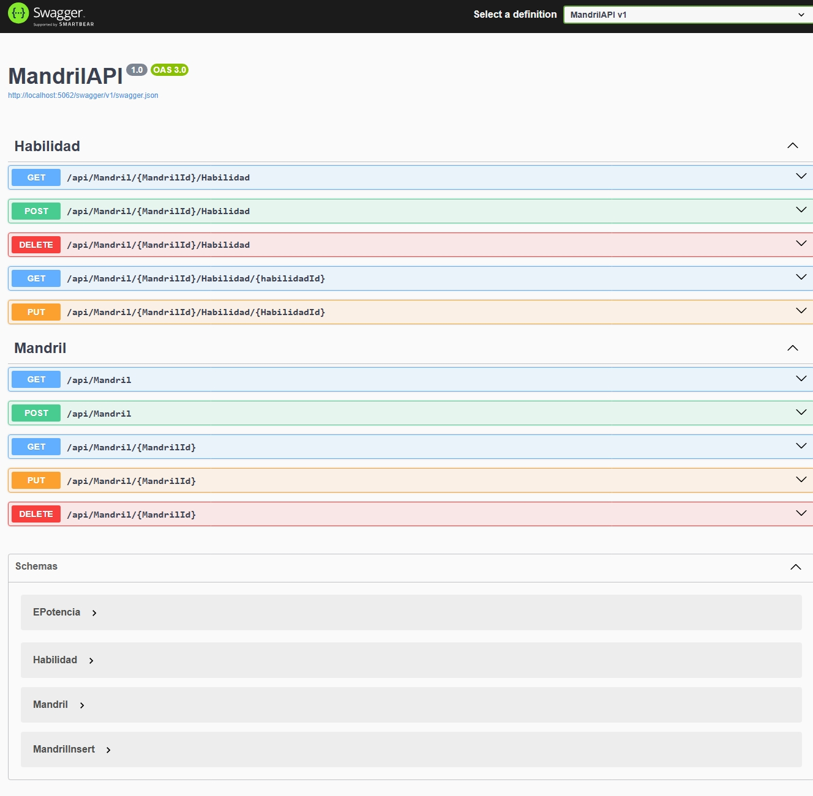

<<<<<<< HEAD
# MandrilAPI 🐒

API REST construida con ASP.NET Core 8.0 para gestionar "Mandriles" y sus habilidades. Este proyecto sirve como ejemplo educativo para diseño de APIs RESTful en .NET.

## 🚀 Funcionalidades

- CRUD de Mandriles
- CRUD de Habilidades
- Almacenamiento simulado en memoria (`MandrilDataStore`)
- Documentación Swagger integrada

## 🛠️ Tecnologías

- .NET 8
- ASP.NET Core
- Swagger/OpenAPI
- C#

## 🧪 Cómo ejecutar

1. Clona el repositorio
2. Abre la solución `MandrilAPI.sln` en Visual Studio
3. Selecciona el proyecto `MandrilAPI` como startup
4. Presiona `F5` o ejecuta con:

bash
dotnet run

La documentación Swagger estará disponible en `https://localhost:5062/swagger` (puede variar).

## 📂 Estructura del proyecto

- `Controllers/` – Endpoints HTTP
- `Models/` – Estructuras de datos
- `Services/` – Lógica de negocio / almacenamiento simulado
- `Helpers/` – Utilidades y constantes

## 📌 Notas

- No utiliza base de datos real, sino almacenamiento en memoria.
- Ideal como base para pruebas o prácticas educativas.

## 📷 Capturas (opcional)

 <!-- Cambia el nombre si usás otro -->

## 🔮 Futuras mejoras

- Conexión a base de datos real (SQL Server, PostgreSQL, etc.)
- Autenticación JWT
- Pruebas unitarias con xUnit

## 🙌 Autor

- [Daniel Duran](https://www.linkedin.com/in/duran-daniel)

=======
# MandrilAPI
>>>>>>> a492e762ac1f069fa83d243eb32e0bcd144faa2a
